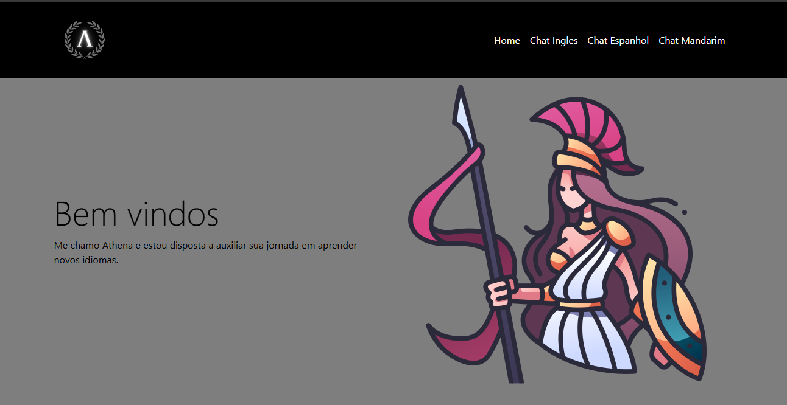

# Projeto TCC

> Chatbot para aprendizado de idiomas

Projeto construido duranta
a graduação de engenharia
da computação.

[linkClique aqui para 
acessar](https://github.com/Rhickley/TCC.git)

## 🛠 Tecnologias

-HTML
-CSS
-Python
-Javascript
-Flask
-Api (OpenAI)
-Git e Github

## Contato

rhickley01@gmail.com
kaiolincoln2001@hotmail.com
joseniltonvca@outlook.com.br
